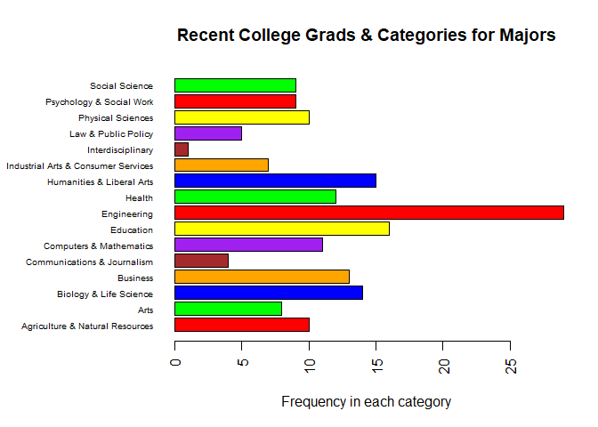

# 6306 Assignment 4 for Luay Dajani

Homework done as per specifications with Markdown formatted as an HTML file.

This work available on the Github repository: https://github.com/LuayD/SMU-MSDS/tree/master/SMU-MSDS-6306-HW4

Please note data for this homework from fivethirtyeight available at github: https://github.com/rudeboybert/fivethirtyeight 

## Questions 1: FiveThirtyEight Data

### 1a: Setup Environment and install packages


```
## [1] "Using R version 3.3.2 (2016-10-31)"
```

```
## Installing package into 'C:/Users/Luay/Documents/R/win-library/3.3'
## (as 'lib' is unspecified)
```

```
## package 'fivethirtyeight' successfully unpacked and MD5 sums checked
## 
## The downloaded binary packages are in
## 	C:\Users\Luay\AppData\Local\Temp\RtmpUzDz1J\downloaded_packages
```

```
## Warning: package 'fivethirtyeight' was built under R version 3.3.3
```

### 1b: Load 18th dataset in library


```r
#set 18th data set into "df"
df <- college_recent_grads
```

### 1c: Display detailed list of data sets for the package


```r
#use vingette and print out URL
#vin <- browseVignettes(package = "fivethirtyeight") #could not figure this out!!! so went ahead and out the URL of interest from the packsge below:

print(c("Please see more information about this topic at  http://fivethirtyeight.com/features/the-economic-guide-to-picking-a-college-major"))
```

```
## [1] "Please see more information about this topic at  http://fivethirtyeight.com/features/the-economic-guide-to-picking-a-college-major"
```

### 1d: Give dimentions & Column names of data frame


```r
#print dimentions
print(paste("The data set college_recent_grads in fivethirtyeight has"
            , dim(df)[2]
            , "Columns, and"
            , dim(df)[1]
            , "Rows."
))
```

```
## [1] "The data set college_recent_grads in fivethirtyeight has 21 Columns, and 173 Rows."
```

```r
#print column names
print("The column names include the following:")
```

```
## [1] "The column names include the following:"
```

```r
cat(names(df), sep = ", ")
```

```
## rank, major_code, major, major_category, total, sample_size, men, women, sharewomen, employed, employed_fulltime, employed_parttime, employed_fulltime_yearround, unemployed, unemployment_rate, p25th, median, p75th, college_jobs, non_college_jobs, low_wage_jobs
```

## Questions 2: FiveThirtyEight Data Summary

### 2a: Write Column names and Column Number


```r
#print column names and Number
cat("Again, the column names include the following:\n"
    , names(df)
    , "\nThe numbers of column in this data set are: "  
    , length(names(df))
)
```

```
## Again, the column names include the following:
##  rank major_code major major_category total sample_size men women sharewomen employed employed_fulltime employed_parttime employed_fulltime_yearround unemployed unemployment_rate p25th median p75th college_jobs non_college_jobs low_wage_jobs 
## The numbers of column in this data set are:  21
```

### 2b: give the unique listing for major categories in the df and frequency they show up


```r
#print column names and Number
library(plyr)
major_count <- count(df, 'major_category')
major_count
```

```
##                         major_category freq
## 1      Agriculture & Natural Resources   10
## 2                                 Arts    8
## 3               Biology & Life Science   14
## 4                             Business   13
## 5          Communications & Journalism    4
## 6              Computers & Mathematics   11
## 7                            Education   16
## 8                          Engineering   29
## 9                               Health   12
## 10           Humanities & Liberal Arts   15
## 11 Industrial Arts & Consumer Services    7
## 12                   Interdisciplinary    1
## 13                 Law & Public Policy    5
## 14                   Physical Sciences   10
## 15            Psychology & Social Work    9
## 16                      Social Science    9
```

### 2c: Barplot of unique major categories and frequency


```r
#create the barplot with label, title, horizontal
par(las = 2)
par(mar=c(5,10,4,2)) # increase y-axis margin (c(bottom, left, top, right))
barplot(major_count$freq
        , main="Recent College Grads & Categories for Majors"
        , horiz=TRUE
        , xlab="Frequency in each category"
        , cex.names=0.6
        , names.arg = major_count$major_category
        , col=c("red","green","blue","orange","brown","purple","yellow")
        )
```

<!-- -->

### 2d: fivethirtyeight recent college grads -> csv file w/o row labels


```r
#write to csv file df "recent college grads" data
write.csv(df
          , "fivethirtyeight_recent-college-grads.csv"
          , row.names = FALSE
          )
```

## Question 3: Codebook

### 3a: Add New Repository on Github
Available at: https://github.com/LuayD/SMU-MSDS

### 3b: Add README.md to root 
Done and Available at: https://github.com/LuayD/SMU-MSDS

### 3c: Add nested README to and assignment folder and credit fivethirtyeight
Done and Available at: https://github.com/LuayD/SMU-MSDS/tree/master/SMU-MSDS-6306-HW4

### 3d: Link to Github:
Done, and mentioned multiple times in this document. Relevant folders include:
-Main root section: https://github.com/LuayD
-Root SMU MSDS repository section: https://github.com/LuayD/SMU-MSDS 
